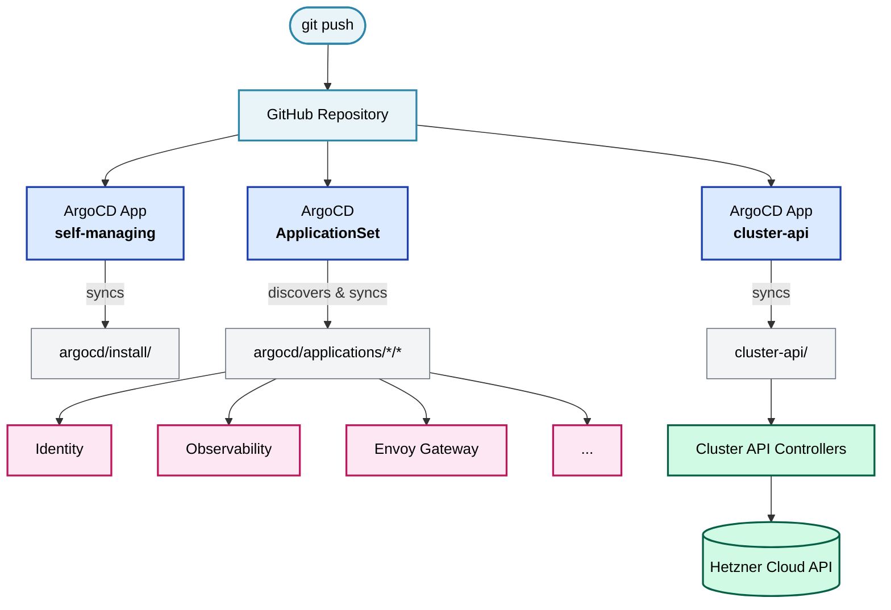
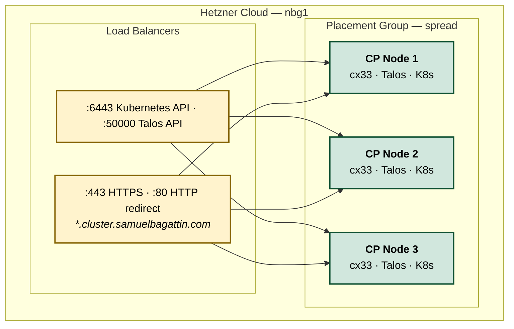
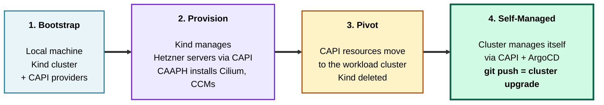

# Self-Managing Kubernetes on Hetzner Cloud

A fully self-managing Kubernetes cluster on Hetzner Cloud, built with [Talos Linux](https://www.talos.dev/), [Cluster API](https://cluster-api.sigs.k8s.io/), and [ArgoCD](https://argo-cd.readthedocs.io/).

**The core idea**: after an initial bootstrap from a temporary local Kind cluster, the production cluster manages its own infrastructure and platform. A `git push` that bumps the Kubernetes version triggers an automated rolling replacement of every node — including the control plane — with zero manual intervention.

## How Self-Management Works

The cluster sustains itself through two reconciliation loops:



**ArgoCD** syncs three top-level applications from this repo:
1. **Itself** (`argocd/install/`) — ArgoCD manages its own installation via Kustomize
2. **Cluster API manifests** (`cluster-api/`) — the `Cluster`, `HetznerCluster`, and `TalosControlPlane` specs that define the infrastructure
3. **Platform ApplicationSet** (`argocd/applications/*/*`) — dynamically discovers and deploys every platform component as a Helm release

**Cluster API** runs inside the cluster it manages. When ArgoCD syncs a change to the `TalosControlPlane` spec (e.g., a Kubernetes version bump), CAPI orchestrates a rolling update: provisions a new node, waits for it to join, drains and removes the old one — repeated for each of the 3 control-plane nodes.

This is what makes `git push` = full cluster upgrade possible.

## Architecture

### Infrastructure



This is a **control-plane-only cluster** — all 3 nodes are control-plane members with `allowSchedulingOnControlPlanes: true`. There are no dedicated workers. All workloads (ArgoCD, identity, observability, etc.) schedule directly on the control-plane nodes.

### Platform Stack

| Layer | Component | Purpose |
|---|---|---|
| **OS** | Talos Linux | Immutable, API-managed OS. No SSH, no shell, no package manager. |
| **Kubernetes** | Kubernetes | 3-node control plane, external cloud provider |
| **CNI** | Cilium | eBPF networking, kube-proxy replacement, Hubble observability |
| **Ingress** | Envoy Gateway | Gateway API implementation, TLS termination via cert-manager |
| **Certificates** | cert-manager | Let's Encrypt via Cloudflare DNS-01 challenge |
| **Identity** | Ory Hydra + Kratos | OAuth 2.0 / OIDC provider + self-service identity management |
| **Database** | CloudNativePG | PostgreSQL (2 replicas), shared by Hydra, Kratos, and Grafana |
| **Metrics** | VictoriaMetrics | Prometheus-compatible TSDB, long-term storage |
| **Logs** | VictoriaLogs | Log aggregation, integrated with VictoriaMetrics |
| **Traces** | OpenTelemetry Collector | Distributed tracing pipeline via OTel Operator |
| **Dashboards** | Grafana | Visualization, backed by PostgreSQL, OIDC-authenticated |
| **Image distribution** | Spegel | Peer-to-peer container image sharing between nodes |
| **Storage** | Hetzner CSI | Dynamic PersistentVolume provisioning |
| **GitOps** | ArgoCD | Self-managing, OIDC-authenticated, ApplicationSet-driven |
| **Secrets** | SOPS + age | Git-encrypted secrets, decrypted by ArgoCD at sync time |

### Exposed Applications

All applications are served via Envoy Gateway under `*.cluster.samuelbagattin.com` with Let's Encrypt TLS.

| Application | URL | Notes |
|---|---|---|
| ArgoCD | `https://argocd.cluster.samuelbagattin.com` | GitOps dashboard, OIDC-authenticated |
| Grafana | `https://grafana.cluster.samuelbagattin.com` | Observability dashboards, OIDC-authenticated |
| Ory Kratos UI | `https://id.cluster.samuelbagattin.com` | Self-service identity (login, registration) |
| Ory Hydra | `https://auth.cluster.samuelbagattin.com` | OAuth 2.0 / OIDC provider — not user-facing, consumed by ArgoCD and Grafana for authentication |
| Demo (podinfo) | `https://demo.cluster.samuelbagattin.com` | Simple test application |

### Cluster API Providers

| Provider | Role |
|---|---|
| CAPI Core | Cluster lifecycle orchestration |
| CAPH | Hetzner Cloud infrastructure (servers, LBs, networks) |
| CABPT | Talos bootstrap configuration generation |
| CACPPT | Talos control plane management (rolling updates) |
| CAAPH | Helm-based addon installation on workload clusters |

## Bootstrap Process

The cluster starts from nothing and reaches full self-management in 4 phases:



### Prerequisites

```bash
brew install kind helm packer kubectl clusterctl
brew install siderolabs/tap/talosctl
```

### Steps

```bash
# Set Hetzner Cloud API token
export HCLOUD_TOKEN="your-token"

# 1. Build Talos disk image snapshot on Hetzner
make image

# 2. Bootstrap: Kind cluster → CAPI providers → provision Hetzner servers → extract kubeconfig
make bootstrap

# 3. Create and apply Hetzner firewall (CAPH doesn't manage firewalls)
make firewall
make firewall-apply

# 4. Pivot CAPI from Kind to the workload cluster (self-management begins)
make pivot

# 5. Clean up the temporary Kind cluster
make clean
```

After pivot, manually install ArgoCD and apply the initial secrets:

```bash
export KUBECONFIG=/tmp/k8s.kubeconfig

# Install ArgoCD
kubectl apply -k argocd/install/

# Apply encrypted secrets (requires SOPS age key)
sops -d argocd/secrets/secrets.sops.yaml | kubectl apply -f -

# Activate self-management — this single command closes the loop
kubectl apply -f argocd/apps/
```

That last `kubectl apply` is the moment everything becomes self-managing. It applies three Application manifests that together bootstrap the entire system:

1. **`argocd-self.yaml`** — ArgoCD starts reconciling its own installation from `argocd/install/` (Kustomize). From now on, ArgoCD config changes are made via git, not kubectl.
2. **`cluster-api.yaml`** — ArgoCD takes ownership of the CAPI manifests in `cluster-api/`. The `Cluster`, `HetznerCluster`, and `TalosControlPlane` specs are now continuously synced from git — any change (like a Kubernetes version bump) is automatically applied by ArgoCD, which triggers CAPI to reconcile the infrastructure.
3. **`platform-appset.yaml`** — The ApplicationSet scans `argocd/applications/*/*` and dynamically creates an ArgoCD Application for each directory. Every platform component (Cilium, identity stack, observability, etc.) is deployed and kept in sync.

From this point on, all changes are made via `git push`.

## Rolling Kubernetes Upgrade

To upgrade Kubernetes across the entire cluster:

1. Update the Kubernetes version in `cluster-api/cluster.yaml` (`TalosControlPlane.spec.version`)
2. Update the Talos image if needed in the `HCloudMachineTemplate`
3. `git push`

ArgoCD syncs the change → CAPI detects the spec drift → rolling update begins:
- Scale up to 4 nodes (new node with updated version joins)
- Drain and cordon the oldest node
- Remove it from etcd, delete the machine
- Repeat for each remaining old node
- Cluster is now fully upgraded on the new version

This has been tested through multiple successive Kubernetes minor version upgrades.

## Project Structure

```
.
├── Makefile                        # Bootstrap, pivot, and utility commands
├── .sops.yaml                      # SOPS encryption rules (age key)
│
├── packer/
│   └── hcloud_talosimage.pkr.hcl  # Builds Talos snapshots on Hetzner
│
├── cluster-api/                    # CAPI manifests (synced by ArgoCD)
│   ├── cluster.yaml               # Cluster + HetznerCluster + TalosControlPlane
│   ├── addons.yaml                # HelmChartProxy: Cilium, hcloud-ccm, talos-ccm
│   ├── machine-health-check.yaml  # Auto-remediation for unhealthy nodes
│   ├── network-policies.yaml      # Cilium policies for CAPI controllers
│   └── clusterctl.yaml            # Provider URLs for clusterctl init
│
├── argocd/
│   ├── install/                   # ArgoCD Kustomize installation (self-managed)
│   ├── apps/
│   │   ├── argocd-self.yaml       # ArgoCD manages itself
│   │   ├── cluster-api.yaml       # ArgoCD syncs CAPI manifests
│   │   └── platform-appset.yaml   # ApplicationSet: discovers apps from directories
│   ├── applications/              # Platform Helm charts (one dir per app)
│   │   ├── cacppt-system/         #   CACPPT deadlock resolver
│   │   ├── cert-manager/          #   TLS certificate automation
│   │   ├── cnpg-system/           #   CloudNativePG operator
│   │   ├── demo/                  #   podinfo demo app
│   │   ├── envoy-gateway-system/  #   Gateway API + Envoy proxy
│   │   ├── identity/              #   Hydra, Kratos, Kratos UI, Hydra Maester
│   │   ├── kube-system/           #   Cilium extras, CSI, metrics-server, OIDC RBAC
│   │   ├── observability/         #   VictoriaMetrics, OTel operator + collectors
│   │   ├── postgres/              #   CloudNativePG cluster (2 replicas)
│   │   └── spegel/                #   P2P image distribution
│   └── secrets/
│       ├── secrets.sops.yaml      # Encrypted secrets (SOPS + age)
│       └── secrets.example.yaml   # Template with placeholders
│
└── cacppt-rolling-update-bug-report.md  # Upstream bug report (see below)
```

## CACPPT Rolling Update Bug

During development, I discovered a **deadlock bug** in the Cluster API Control Plane Provider for Talos (CACPPT) that breaks every rolling update. The full root cause analysis is in [`cacppt-rolling-update-bug-report.md`](cacppt-rolling-update-bug-report.md).

**In short**: during a rolling update, CACPPT removes an etcd member from the old node but then fails its own health check — it expects N etcd members for N machines, but the member is already gone while the machine still exists. The health check gates machine deletion, creating an unrecoverable deadlock.

**Workaround**: this repo includes a [`cacppt-deadlock-resolver`](argocd/applications/cacppt-system/cacppt-deadlock-resolver/) that runs as a sidecar, detects stuck machines via the Talos gRPC API, and automatically deletes them to unblock the rollout.

## Limitations

This is a personal infrastructure project, not a production-ready template. Notable gaps:

- **No etcd backups** — a simultaneous failure of 2+ nodes would lose the cluster
- **No disaster recovery** — no automated restore procedure or cross-region redundancy
- **CAPI self-management is fragile** — if the CAPI controllers crash during a rolling update, the cluster can enter a state that requires manual `talosctl` and `kubectl` intervention to recover
- **No multi-tenancy** — all pods run with `privileged` security context
- **Single region** — all nodes in nbg1, no geographic distribution
- **Manual firewall** — Hetzner firewalls are created outside CAPI (not reconciled)

## Technologies

Talos Linux, Kubernetes, Cluster API (CAPI, CAPH, CABPT, CACPPT, CAAPH), ArgoCD, Cilium, Envoy Gateway (Gateway API), cert-manager, Ory Hydra, Ory Kratos, CloudNativePG, PostgreSQL, VictoriaMetrics, VictoriaLogs, OpenTelemetry, Grafana, Spegel, Hetzner Cloud, Packer, SOPS, age.
